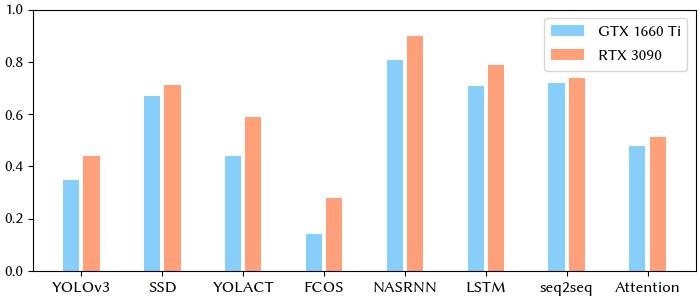
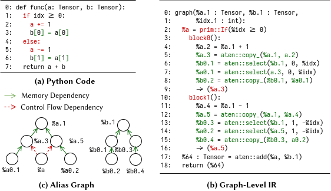
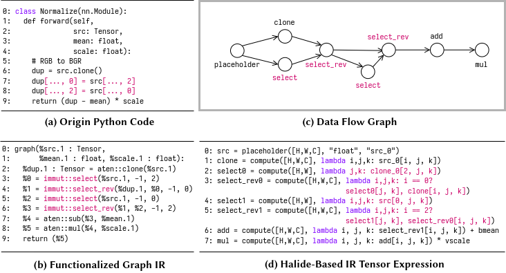
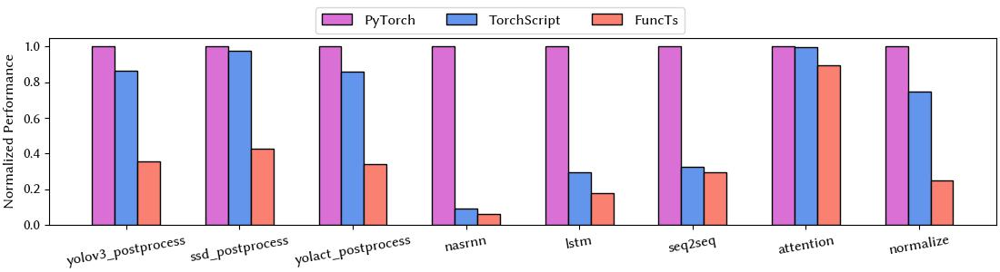
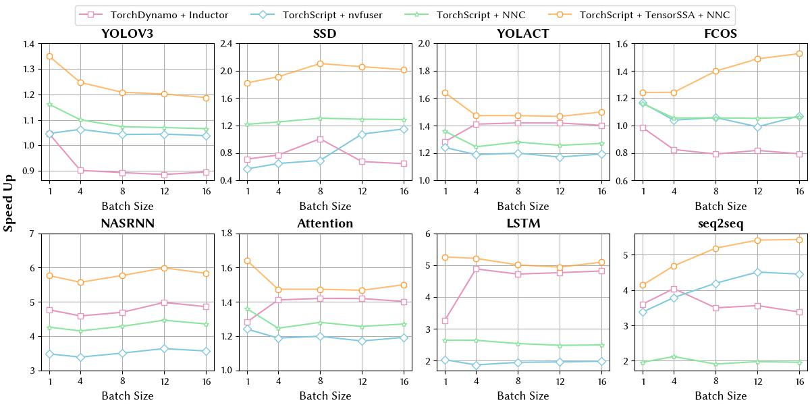
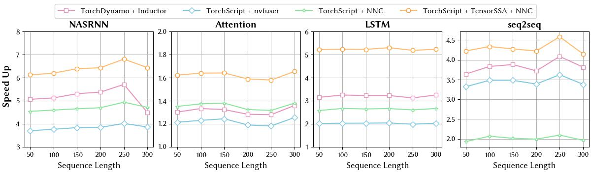
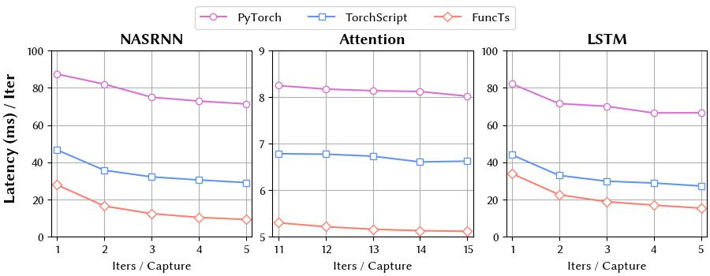

# FuncTs：TorchScript Functionalization

- ***paper correction***
  - [Figure 2](./docs/imgs/ControlDependencyMemoryDependency.png): `%b.5`->`%b.1.`

## Bulid from source

- PyTorch is all you need to compile `functs`:

```python
python -c "import torch"; echo $?
>>> 0
python setup.py develop --user
```

- Supported PyTorch version: `V2.1.0`

We have discovered that numerous standard workloads are written using imperative tensor programs, which do not lend themselves well to direct
kernel fusion. While the compute library developed by hardware vendors adequately supports pure function computation-intensive operators, imperative tensor programs often contain excessive control flow and side-effects due to tensor-level mutation (such as view and inplace operators), resulting in limited fusion scope. The following timeline illustrates the proportion of time dedicated to these aspects in eight different workloads:



## Use FuncTs to perform functionalization

A [simple example](./examples/get_started.py) are shown as follow:

```python
import torch
import torch._C._te as te
import functs._C

# substitute your own function here~
def func(a: torch.Tensor, b: torch.Tensor, n: int):
  a = a.clone()
  b = b.clone()
  for i in range(n):
    b[i] = b[i] + 1
  return b

# func = func_data_control_flow_dependency
func = func

# torchscript
jit_func = torch.jit.script(func)
print("graph before functionalization")
jit_func.graph.alias_db().dump()

# functs
functs_func = functs.jit.script(func)
print("graph after functionalization")
functs_func.graph.alias_db().dump()

# check equal
a: torch.Tensor = torch.randn([1024, 1024])
b: torch.Tensor = torch.randn([1024, 1024])
n = 3

print(torch.allclose(jit_func(a, b, 3), func(a, b, 3)))
# >>> True

```

After running the script above, the graph-level IR before and after functionalization are printed as follow:

- Before functionalization:

```ruby
# before functionalization
graph(%a.1 : Tensor,
      %b.1 : Tensor,
      %n.1 : int):
  %28 : bool = prim::Constant[value=0]()
  %18 : int = prim::Constant[value=0]()
  %12 : bool = prim::Constant[value=1]()
  %7 : NoneType = prim::Constant()
  %20 : int = prim::Constant[value=1]()
  %b.5 : Tensor = aten::clone(%b.1, %7)
   = prim::Loop(%n.1, %12)
    block0(%i.1 : int):
      %19 : Tensor = aten::select(%b.5, %18, %i.1)
      %22 : Tensor = aten::add(%19, %20, %20)
      %27 : Tensor = aten::select(%b.5, %18, %i.1)
      %29 : Tensor = aten::copy_(%27, %22, %28)
      -> (%12)
  return (%b.5)
```

- After functionalization:

```ruby
graph(%a.5 : Tensor,
      %b.11 : Tensor,
      %n.1 : int):
  %42 : NoneType = prim::Constant()
  %b.1 : Tensor = aten::clone(%b.11, %42)
  %18 : int = prim::Constant[value=0]()
  %12 : bool = prim::Constant[value=1]()
  %20 : int = prim::Constant[value=1]()
  %b.5 : Tensor = aten::clone(%b.1, %42)
  %52 : Tensor = prim::Loop(%n.1, %12, %b.5)
    block0(%i.1 : int, %53 : Tensor):
      %44 : Tensor = immut::select(%53, %18, %i.1)
      %22 : Tensor = aten::add(%44, %20, %20)
      %48 : Tensor = immut::select_rev(%53, %22, %18, %i.1)
      -> (%12, %48)
  return (%52)
```

You can also run the pass step by step and print the mid result ([Convert to TensorSSA](./functs/csrc/jit/passes/convert_to_tensorssa.cpp) -> Remove Update -> DCE & CSE)

```python
import functs
g = fn.graph
functs._C._jit_pass_convert_to_tensorssa(g)
print(g)
functs._C._jit_pass_remove_update(g)
pring(g)
# FuncTs ConvertToTensorSSA is completely compatible with other torchscript passes 
# such as DCE, CES, Constant propagation, kernel fusion, diff graph generation ...
torch._C._jit_pass_dce(g)
torch._C._jit_pass_cse(g)
torch._C._jit_pass_constant_propagation(g)
```

Functionalization of a more complicated case is shown as follow:



- Before functionalization

```ruby
graph(%a.1 : Tensor,
      %b.1 : Tensor,
      %idx.1 : int):
  %30 : bool = prim::Constant[value=0]()
  %4 : NoneType = prim::Constant()
  %10 : int = prim::Constant[value=0]()
  %14 : int = prim::Constant[value=1]()
  %a.5 : Tensor = aten::clone(%a.1, %4)
  %b.5 : Tensor = aten::clone(%b.1, %4)
  %11 : bool = aten::ge(%idx.1, %10)
  %a : Tensor = prim::If(%11)
    block0():
      %a.9 : Tensor = aten::add(%a.5, %14, %14)
      %23 : Tensor = aten::select(%b.5, %10, %idx.1)
      %29 : Tensor = aten::select(%a.9, %10, %idx.1)
      %31 : Tensor = aten::copy_(%23, %29, %30)
      -> (%a.9)
    block1():
      %a.17 : Tensor = aten::sub(%a.5, %14, %14)
      %42 : int = aten::neg(%idx.1)
      %44 : Tensor = aten::select(%b.5, %10, %42)
      %51 : int = aten::neg(%idx.1)
      %53 : Tensor = aten::select(%a.17, %10, %51)
      %55 : Tensor = aten::copy_(%44, %53, %30)
      -> (%a.17)
  %64 : Tensor = aten::add(%a, %b.5, %14)
  return (%64)
```

- After functionalization

```ruby
graph(%a.35 : Tensor,
      %b.11 : Tensor,
      %idx.1 : int):
  %79 : NoneType = prim::Constant()
  %b.1 : Tensor = aten::clone(%b.11, %79)
  %a.1 : Tensor = aten::clone(%a.35, %79)
  %10 : int = prim::Constant[value=0]()
  %14 : int = prim::Constant[value=1]()
  %a.5 : Tensor = aten::clone(%a.1, %79)
  %b.5 : Tensor = aten::clone(%b.1, %79)
  %11 : bool = aten::ge(%idx.1, %10)
  %a : Tensor, %93 : Tensor = prim::If(%11)
    block0():
      %a.9 : Tensor = aten::add(%a.5, %14, %14)
      %29 : Tensor = aten::select(%a.9, %10, %idx.1)
      %86 : Tensor = immut::select_rev(%b.5, %29, %10, %idx.1)
      -> (%a.9, %86)
    block1():
      %a.17 : Tensor = aten::sub(%a.5, %14, %14)
      %42 : int = aten::neg(%idx.1)
      %53 : Tensor = aten::select(%a.17, %10, %42)
      %90 : Tensor = immut::select_rev(%b.5, %53, %10, %42)
      -> (%a.17, %90)
  %64 : Tensor = aten::add(%a, %93, %14)
  return (%64)
```

```
> **_NOTE:_**  For illustration, we canonicalize the code in *Figure* by adjusting the variable name by hand. 
```

We construct several [test cases](./test/test_basic.py), which shows that our method can perform functionalization beyond the control flow. We define a series of [Access and Assign Operators](./functs/csrc/jit/ir/symbol_ext.h) which are immutable to perform functionalization as shown in the table below:

| operator            | Access operator      | Assign Operator          |
| ------------------- | -------------------- | ------------------------ |
| `aten::copy_`     | `immut::Assign`    | `immut::Assign`        |
| `aten::select`    | `immut::select`    | `immut::select_rev`    |
| `aten::slice`     | `immut::slice`     | `immut::slice_rev`     |
| `aten::squeeze`   | `immut::squeeze`   | `immut::unsqueeze`     |
| `aten::unsqueeze` | `immut::unsqueeze` | `immut::squeeze`       |
| `aten::view`      | `immut::view`      | `immut::view`          |
| `aten::reshape`   | `immut::reshape`   | `immut::reshape`       |
| `aten::expand`    | `immut::expand`    | `immut::expand_rev`    |
| `aten::expand_as` | `immut::expand_as` | `immut::expand_as_rev` |
| `aten::repeat`    | `immut::repeat`    | `immut::repeat_rev`    |
| `aten::index`     | `immut::index`     | `immut::index_rev`     |

## Optimization

### Vertical Optimization

We utilize PyTorch NNC to implement several view tensor expressions, which are part of a domain-specific language (DSL) that can be scheduled
 and automatically converted to device code, including CUDA. The code generation for these operators has been tested in [test tensorexpr](./test/test_immut_tensorexpr.py). An example of converting a  functionalized program into an NNC tensor expression is illustrated below:



The functional part of the program can be representated as a direct acyclic graph (DAG). As a result, it can be converted to NNC directly.

### Horizontal Parallelization

We extend NNC to support [horizontal parallization](./fait/tensorexpr/functor_parallization.h), pure function inner the loop without loop carried dependency can be fused to one kernel and run simultaneously.

## Evaluation

### Speed Up

- The performance speed up is shown as follow:
- [get_latency.py](./scripts/get_latency.py)
- [1660ti log](./scripts/latency_log.txt)


### Kernel launch counts

The kernel counts perfomance is shown as follow:



After functionalization, our performance of kernel launch is better than TorchScript + NNC without Tensor in all workloads. Specificly, compared with TorchDynamo + TorchInductor, the performance boost of kernel launch in NASRNN, seq2seq and Attention is not obviously because TorchDynamo is a tracing-based jit and expand the control flow by unrolling, which have more fusion scope than TorchScipt frontend.

### Scalability

- In different batch sizes



- in different sequence length



### Latency with CUDA Graph



[CUDA Graphs](https://developer.nvidia.com/blog/cuda-10-features-revealed/), which made its debut in CUDA 10, let a series of CUDA kernels to be defined and encapsulated as a single unit, i.e., a graph of operations, rather than a sequence of individually-launched operations. We profile the speedup w.r.t. PyTorch Eager in different iters per graph capture. We select NASRNN, Attention and LSTM because other workloads cannot be captured as a whole graph because of unsupported operators and structures. The figure above shows that all compilation pipeline can equally speedup by CUDA Graph.
