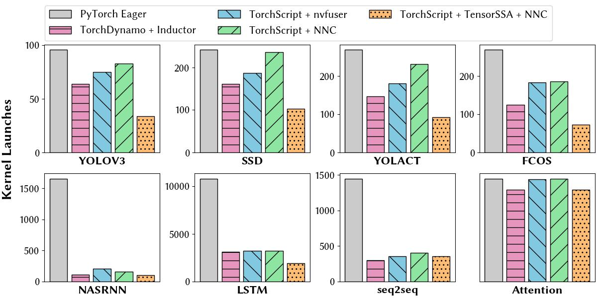
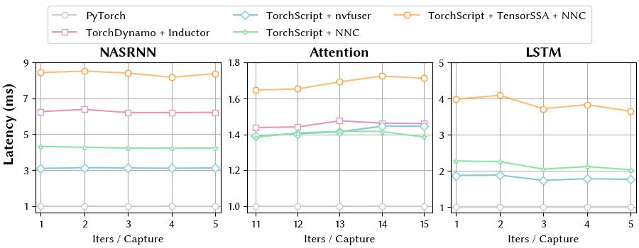

# FuncTs：TorchScript Functionalization

- ***paper correction***
  - [Figure 2](./docs/imgs/ControlDependencyMemoryDependency.png): `%b.5`->`%b.1.`
- ***paper notation***
  - [Figure 3](./docs/imgs/TensorSSAExample.png): In (c), the number before `immut::Access`, `immut::Assign` and `tensorssa::Update` is the line number in (d). We illustrate more details of [Figure 3](./docs/imgs/TensorSSAExample.png) in this README file.

## Bulid from source

- PyTorch is all you need to compile `functs`:

```python
python -c "import torch"; echo $?
>>> 0
python setup.py develop --user
```

- Supported PyTorch version: `V2.1.0`

We have discovered that numerous standard workloads are written using imperative tensor programs, which do not lend themselves well to direct
kernel fusion. While the compute library developed by hardware vendors adequately supports pure function, computation-intensive operators, imperative tensor programs often contain excessive control flow and side effects due to tensor-level mutation (such as view and in-place operators), resulting in limited fusion scope. The following timeline illustrates the proportion of time dedicated to these aspects in eight different workloads:


## Use FuncTs to perform functionalization

A [simple example](./examples/get_started.py) of functionalization beyond control flow is depicted as follows:


We split the algorithm into two steps:

- **Rewrite Mutation** (c). The **Rewrite Mutation** step includes two key steps:
  - **Pass Up**. In the **pass-up** step, suppose `v` is a view of `t`, the algorithm traverses the view path from `v` to `t`. When each variable is visited, an `x′ = immut::Assign(x, v′, [·])` operator is inserted into the program.
  - **Pass Down**. In the **pass-down** step, we traverse from the root node `v` to another branch that hasn't traversed by the pass-up step, while each variable is firstly visited, a `v′ = immgt::Access(x′, [·])` operator is inserted. To annotate the tensor version for subsequent block propagation, a `tensorssa::Update(v′, v)` statement is generated at the same time.
- **Block Propagation** (d). The **Block Propagation** step visits all generated `tensorssa::Update(x′,x)`, propagating the tensor mutation beyond the control flow.

By these steps, we generate a new graph. Accordingly, **we can explore a larger kernel fusion optimization space than the previous methods**.

### Tensor `Access` and Tensor `Assign`

As mentioned above, we generate `Access` and `Assign` operators during transformation. The `Access` operator is the immutable version of the `view` operator. The `Assign` operator is for generating immutable equivalent substitution of `view` and `mutation` combining with the `Access` operator. The figure below depicts the execution process of `aten::view`, `immut::Access` and `immut::Assign` operators.


The `Access` and `Assign` operators  are two abstractions of a series of [operator instances](./functs/csrc/jit/ir/symbol_ext.h), which are shown in the table below.

| operator            | Access operator      | Assign Operator          |
| ------------------- | -------------------- | ------------------------ |
| `aten::copy_`     | `immut::Assign`    | `immut::Assign`        |
| `aten::select`    | `immut::select`    | `immut::select_rev`    |
| `aten::slice`     | `immut::slice`     | `immut::slice_rev`     |
| `aten::squeeze`   | `immut::squeeze`   | `immut::unsqueeze`     |
| `aten::unsqueeze` | `immut::unsqueeze` | `immut::squeeze`       |
| `aten::view`      | `immut::view`      | `immut::view`          |
| `aten::reshape`   | `immut::reshape`   | `immut::reshape`       |
| `aten::expand`    | `immut::expand`    | `immut::expand_rev`    |
| `aten::expand_as` | `immut::expand_as` | `immut::expand_as_rev` |
| `aten::repeat`    | `immut::repeat`    | `immut::repeat_rev`    |
| `aten::index`     | `immut::index`     | `immut::index_rev`     |

### More Details

For learning or using `FuncTs`, you can functionalize the program step by step with our pass. The original python code is:

```python
def func(a: torch.Tensor, b: torch.Tensor, n: int):
  a = a.clone()
  b = b.clone()
  for i in range(n):
    b[i] = b[i] + 1
  return b
```

We can dump the `torch.Graph` IR generated by `torch.jit.script` here.

```ruby
graph(%a.1 : Tensor,
      %b.1 : Tensor,
      %n.1 : int):
  %28 : bool = prim::Constant[value=0]()
  %18 : int = prim::Constant[value=0]() # examples/get_started.py:14:11
  %12 : bool = prim::Constant[value=1]() # examples/get_started.py:13:2
  %7 : NoneType = prim::Constant()
  %20 : int = prim::Constant[value=1]() # examples/get_started.py:14:18
  %b.5 : Tensor = aten::clone(%b.1, %7) # examples/get_started.py:12:6
   = prim::Loop(%n.1, %12) # examples/get_started.py:13:2
    block0(%i.1 : int):
      %19 : Tensor = aten::select(%b.5, %18, %i.1) # examples/get_started.py:14:11
      %22 : Tensor = aten::add(%19, %20, %20) # examples/get_started.py:14:11
      %27 : Tensor = aten::select(%b.5, %18, %i.1) # examples/get_started.py:14:4
      %29 : Tensor = aten::copy_(%27, %22, %28) # examples/get_started.py:14:4
      -> (%12)
  return (%b.5)
```

The first step is *Rewrite Mutation*, which converts `View` and `Mutation` to equivalent `Access` and `Assign` operators.

```python
# step 1: rewrite mutation
mutate_info = functs._C.TensorSSAMutateInfo()
functs._C._jit_pass_rewrite_mutation(jit_func.graph, mutate_info)
print("graph after rewrite mutation")
print(jit_func.graph)
print("mutated values: ")
print(mutate_info.mutValues)
print("mutated nodes: ")
print(mutate_info.mutNodes)
```

We define an object of `TensorSSAMutateInfo` to collect the mutated values and mutated nodes after `functs._C._jit_pass_rewrite_mutation`. The output isgraph after rewrite mutation

```ruby
graph(%a.1 : Tensor,
      %b.1 : Tensor,
      %n.1 : int):
  %28 : bool = prim::Constant[value=0]()
  %18 : int = prim::Constant[value=0]() # examples/get_started.py:14:11
  %12 : bool = prim::Constant[value=1]() # examples/get_started.py:13:2
  %7 : NoneType = prim::Constant()
  %20 : int = prim::Constant[value=1]() # examples/get_started.py:14:18
  %b.5 : Tensor = aten::clone(%b.1, %7) # examples/get_started.py:12:6
   = prim::Loop(%n.1, %12) # examples/get_started.py:13:2
    block0(%i.1 : int):
      %40 : Tensor = immut::select(%b.5, %18, %i.1)
      %22 : Tensor = aten::add(%40, %20, %20) # examples/get_started.py:14:11
      %41 : Tensor = immut::select(%b.5, %18, %i.1)
      %42 : Tensor = immut::assign(%41, %22, %28)
      %43 : Tensor = immut::assign(%41, %22, %28)
      %44 : Tensor = immut::select_rev(%b.5, %43, %18, %i.1)
      %46 : Tensor = immut::select(%44, %18, %i.1)
      %45 : Tensor = immut::select(%44, %18, %i.1)
      %47 : Tensor = immut::assign(%45, %45, %28)
       = tssa::update(%44, %b.5)
       = tssa::update(%46, %40)
       = tssa::update(%45, %41)
       = tssa::update(%47, %42)
      -> (%12)
  return (%b.5)
```

```python
mutated values: 
[b.5 defined in (%b.5 : Tensor = aten::clone(%b.1, %7)), 
 41 defined in (%41 : Tensor = immut::select(%b.5, %18, %i.1)), 
 40 defined in (%40 : Tensor = immut::select(%b.5, %18, %i.1)), 
 42 defined in (%42 : Tensor = immut::assign(%41, %22, %28))]

mutated nodes: 
{40 defined in (%40 : Tensor = immut::select(%b.5, %18, %i.1)): [ = tssa::update(%46, %40)], 
 42 defined in (%42 : Tensor = immut::assign(%41, %22, %28)): [ = tssa::update(%47, %42)], 
 41 defined in (%41 : Tensor = immut::select(%b.5, %18, %i.1)): [ = tssa::update(%45, %41)], 
 b.5 defined in (%b.5 : Tensor = aten::clone(%b.1, %7)): [ = tssa::update(%44, %b.5)]}
```

The next pass is `functs._C.jit_pass_block_propagation`:

```python
# step 2: block propagation
functs._C._jit_pass_block_propagation(jit_func.graph, mutate_info)
print("graph after block propagation")
print(jit_func.graph)
```

We insert more `tensorssa::Update` nodes for functionalization beyond the control flow. (`= tssa::update(%49, %b.5)` and `= tssa::update(%48, %b.5)`)

```ruby
graph after block propagation
graph(%a.1 : Tensor,
      %b.1 : Tensor,
      %n.1 : int):
  %28 : bool = prim::Constant[value=0]()
  %18 : int = prim::Constant[value=0]() # examples/get_started.py:14:11
  %12 : bool = prim::Constant[value=1]() # examples/get_started.py:13:2
  %7 : NoneType = prim::Constant()
  %20 : int = prim::Constant[value=1]() # examples/get_started.py:14:18
  %b.5 : Tensor = aten::clone(%b.1, %7) # examples/get_started.py:12:6
  %48 : Tensor = prim::Loop(%n.1, %12, %b.5) # examples/get_started.py:13:2
    block0(%i.1 : int, %49 : Tensor):
       = tssa::update(%49, %b.5)
      %40 : Tensor = immut::select(%b.5, %18, %i.1)
      %22 : Tensor = aten::add(%40, %20, %20) # examples/get_started.py:14:11
      %41 : Tensor = immut::select(%b.5, %18, %i.1)
      %42 : Tensor = immut::assign(%41, %22, %28)
      %43 : Tensor = immut::assign(%41, %22, %28)
      %44 : Tensor = immut::select_rev(%b.5, %43, %18, %i.1)
      %46 : Tensor = immut::select(%44, %18, %i.1)
      %45 : Tensor = immut::select(%44, %18, %i.1)
      %47 : Tensor = immut::assign(%45, %45, %28)
       = tssa::update(%44, %b.5)
       = tssa::update(%46, %40)
       = tssa::update(%45, %41)
       = tssa::update(%47, %42)
      -> (%12, %b.5)
   = tssa::update(%48, %b.5)
  return (%b.5)
```

The `tensorssa::Update` indicates the version of values which need to be updated. `functs._C._jit_pass_rename` substitutes the origin version of the value (`UpdateNode.input(1)`) to the new version (`UpdateNode.input(0)`) after this update node (`UpdateNode`).

```python
# step 3: rename
functs._C._jit_pass_rename(jit_func.graph)
print("graph after rename according tensorssa::Update")
print(jit_func.graph)
```

```ruby
graph after rename according tensorssa::Update
graph(%a.1 : Tensor,
      %b.1 : Tensor,
      %n.1 : int):
  %28 : bool = prim::Constant[value=0]()
  %18 : int = prim::Constant[value=0]() # examples/get_started.py:14:11
  %12 : bool = prim::Constant[value=1]() # examples/get_started.py:13:2
  %7 : NoneType = prim::Constant()
  %20 : int = prim::Constant[value=1]() # examples/get_started.py:14:18
  %b.5 : Tensor = aten::clone(%b.1, %7) # examples/get_started.py:12:6
  %48 : Tensor = prim::Loop(%n.1, %12, %b.5) # examples/get_started.py:13:2
    block0(%i.1 : int, %49 : Tensor):
       = tssa::update(%49, %b.5)
      %40 : Tensor = immut::select(%49, %18, %i.1)
      %22 : Tensor = aten::add(%40, %20, %20) # examples/get_started.py:14:11
      %41 : Tensor = immut::select(%49, %18, %i.1)
      %42 : Tensor = immut::assign(%41, %22, %28)
      %43 : Tensor = immut::assign(%41, %22, %28)
      %44 : Tensor = immut::select_rev(%49, %43, %18, %i.1)
      %46 : Tensor = immut::select(%44, %18, %i.1)
      %45 : Tensor = immut::select(%44, %18, %i.1)
      %47 : Tensor = immut::assign(%45, %45, %28)
       = tssa::update(%44, %49)
       = tssa::update(%46, %40)
       = tssa::update(%45, %41)
       = tssa::update(%47, %42)
      -> (%12, %44)
   = tssa::update(%48, %44)
  return (%48)
```

After `functs._C._jit_pass_rename`, `tensorssa::Update` can be removed safely by `functs._C._jit_pass_remove_update`.

```python
# step 4: remove update
functs._C._jit_pass_tensorssa_remove_update(jit_func.graph)
print("graph after remove update")
print(jit_func.graph)
```

```ruby
graph after remove update
graph(%a.1 : Tensor,
      %b.1 : Tensor,
      %n.1 : int):
  %28 : bool = prim::Constant[value=0]()
  %18 : int = prim::Constant[value=0]() # examples/get_started.py:14:11
  %12 : bool = prim::Constant[value=1]() # examples/get_started.py:13:2
  %7 : NoneType = prim::Constant()
  %20 : int = prim::Constant[value=1]() # examples/get_started.py:14:18
  %b.5 : Tensor = aten::clone(%b.1, %7) # examples/get_started.py:12:6
  %48 : Tensor = prim::Loop(%n.1, %12, %b.5) # examples/get_started.py:13:2
    block0(%i.1 : int, %49 : Tensor):
      %40 : Tensor = immut::select(%49, %18, %i.1)
      %22 : Tensor = aten::add(%40, %20, %20) # examples/get_started.py:14:11
      %41 : Tensor = immut::select(%49, %18, %i.1)
      %44 : Tensor = immut::select_rev(%49, %22, %18, %i.1)
      %46 : Tensor = immut::select(%44, %18, %i.1)
      %45 : Tensor = immut::select(%44, %18, %i.1)
      -> (%12, %44)
  return (%48)
```

`FuncTs` `ConvertToTensorSSA` is completely compatible with other `torchscript` passes such as `DCE`, `CES`, `Constant propagation`, `fusion`, `create autodiff subgraphs`.

```python
# step 5: cse, dce, constant_propagation
torch._C._jit_pass_cse(jit_func.graph)
torch._C._jit_pass_dce(jit_func.graph)
torch._C._jit_pass_constant_propagation(jit_func.graph)
print("after csd, dce and constant propagation")
jit_func.graph.alias_db().dump()
```

```ruby
===1. GRAPH===
graph(%a.1 : Tensor,
      %b.1 : Tensor,
      %n.1 : int):
  %18 : int = prim::Constant[value=0]() # examples/get_started.py:14:11
  %12 : bool = prim::Constant[value=1]() # examples/get_started.py:13:2
  %7 : NoneType = prim::Constant()
  %20 : int = prim::Constant[value=1]() # examples/get_started.py:14:18
  %b.5 : Tensor = aten::clone(%b.1, %7) # examples/get_started.py:12:6
  %48 : Tensor = prim::Loop(%n.1, %12, %b.5) # examples/get_started.py:13:2
    block0(%i.1 : int, %49 : Tensor):
      %40 : Tensor = immut::select(%49, %18, %i.1)
      %22 : Tensor = aten::add(%40, %20, %20) # examples/get_started.py:14:11
      %44 : Tensor = immut::select_rev(%49, %22, %18, %i.1)
      -> (%12, %44)
  return (%48)

===2. ALIAS DB===
%49 points to: %b.5
%a.1 points to: WILDCARD for type Tensor
%48 points to: %44
%b.1 points to: WILDCARD for type Tensor

===3. Writes===
```

Functionalization of a more complicated case is shown as follows:


- Before functionalization

```ruby
graph(%a.1 : Tensor,
      %b.1 : Tensor,
      %idx.1 : int):
  %30 : bool = prim::Constant[value=0]()
  %4 : NoneType = prim::Constant()
  %10 : int = prim::Constant[value=0]()
  %14 : int = prim::Constant[value=1]()
  %a.5 : Tensor = aten::clone(%a.1, %4)
  %b.5 : Tensor = aten::clone(%b.1, %4)
  %11 : bool = aten::ge(%idx.1, %10)
  %a : Tensor = prim::If(%11)
    block0():
      %a.9 : Tensor = aten::add(%a.5, %14, %14)
      %23 : Tensor = aten::select(%b.5, %10, %idx.1)
      %29 : Tensor = aten::select(%a.9, %10, %idx.1)
      %31 : Tensor = aten::copy_(%23, %29, %30)
      -> (%a.9)
    block1():
      %a.17 : Tensor = aten::sub(%a.5, %14, %14)
      %42 : int = aten::neg(%idx.1)
      %44 : Tensor = aten::select(%b.5, %10, %42)
      %51 : int = aten::neg(%idx.1)
      %53 : Tensor = aten::select(%a.17, %10, %51)
      %55 : Tensor = aten::copy_(%44, %53, %30)
      -> (%a.17)
  %64 : Tensor = aten::add(%a, %b.5, %14)
  return (%64)
```

- After functionalization

```ruby
graph(%a.35 : Tensor,
      %b.11 : Tensor,
      %idx.1 : int):
  %79 : NoneType = prim::Constant()
  %b.1 : Tensor = aten::clone(%b.11, %79)
  %a.1 : Tensor = aten::clone(%a.35, %79)
  %10 : int = prim::Constant[value=0]()
  %14 : int = prim::Constant[value=1]()
  %a.5 : Tensor = aten::clone(%a.1, %79)
  %b.5 : Tensor = aten::clone(%b.1, %79)
  %11 : bool = aten::ge(%idx.1, %10)
  %a : Tensor, %93 : Tensor = prim::If(%11)
    block0():
      %a.9 : Tensor = aten::add(%a.5, %14, %14)
      %29 : Tensor = aten::select(%a.9, %10, %idx.1)
      %86 : Tensor = immut::select_rev(%b.5, %29, %10, %idx.1)
      -> (%a.9, %86)
    block1():
      %a.17 : Tensor = aten::sub(%a.5, %14, %14)
      %42 : int = aten::neg(%idx.1)
      %53 : Tensor = aten::select(%a.17, %10, %42)
      %90 : Tensor = immut::select_rev(%b.5, %53, %10, %42)
      -> (%a.17, %90)
  %64 : Tensor = aten::add(%a, %93, %14)
  return (%64)
```

```
> **_NOTE:_**  For illustration, we canonicalize the code in *Figure* by adjusting the variable name by hand. 
```

We construct several [test cases](./test/test_basic.py), which show that our method can perform functionalization beyond the control flow.

## Optimization

### Vertical Optimization

We utilize PyTorch NNC to implement several view tensor expressions, which are part of a domain-specific language (DSL) that can be scheduled
 and automatically converted to device code, including CUDA. The code generation for these operators has been tested in [test tensorexpr](./test/test_immut_tensorexpr.py). An example of converting a  functionalized program into an NNC tensor expression is illustrated below:


The functional part of the program can be represented as a direct acyclic graph (DAG). As a result, it can be converted to NNC directly.

### Horizontal Parallelization

We extend NNC to support [horizontal parallelization](./fait/tensorexpr/functor_parallization.h), pure function inner the loop without loop-carried dependency can be fused to one kernel and run simultaneously.

## Evaluation

### Speed Up

The performance speed-up is shown as follows:

- [get_latency.py](./scripts/get_latency.py)
- [1660ti log](./scripts/latency_log.txt)


### Kernel launch counts

The kernel counts performance is shown as follows:



After functionalization, our performance of kernel launch is better than TorchScript + NNC without Tensor in all workloads. Specifically, compared with TorchDynamo + TorchInductor, the performance boost of kernel launch in NASRNN, seq2seq and Attention is not obvious because TorchDynamo is a tracing-based jit and expands the control flow by unrolling, which has more fusion scope than TorchScipt frontend.

### Scalability

- In different batch sizes


- in different sequence length


### Latency with CUDA Graph



[CUDA Graphs](https://developer.nvidia.com/blog/cuda-10-features-revealed/), which made its debut in CUDA 10, let a series of CUDA kernels be defined and encapsulated as a single unit, i.e., a graph of operations, rather than a sequence of individually-launched operations. We profile the speedup w.r.t. PyTorch Eager in different iters per graph capture. We select NASRNN, Attention and LSTM because other workloads cannot be captured as a whole graph because of unsupported operators and structures. The figure above shows that all compilation pipelines can equally speed up by CUDA Graph.
