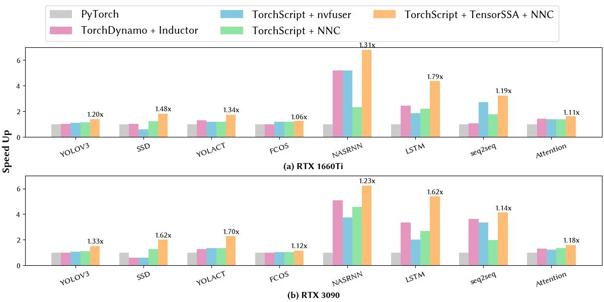

# FuncTs：TorchScript Functionalization

## Bulid from source

- PyTorch is all you need to compile `functs`:

```python
python -c "import torch"; echo $?
>>> 0
python setup.py develop --user
```

- Supported PyTorch version: `V2.1.0`

## Use FuncTs to perform functionalization

A [simple example](./examples/get_started.py) are shown as follow:

```python
import torch
import torch._C._te as te
import functs._C

# substitute your own function here~
def func(a: torch.Tensor, b: torch.Tensor, n: int):
  a = a.clone()
  b = b.clone()
  for i in range(n):
    b[i] = b[i] + 1
  return b

# func = func_data_control_flow_dependency
func = func

# torchscript
jit_func = torch.jit.script(func)
print("graph before functionalization")
jit_func.graph.alias_db().dump()

# functs
functs_func = functs.jit.script(func)
print("graph after functionalization")
functs_func.graph.alias_db().dump()

# check equal
a: torch.Tensor = torch.randn([1024, 1024])
b: torch.Tensor = torch.randn([1024, 1024])
n = 3

print(torch.allclose(jit_func(a, b, 3), func(a, b, 3)))
# >>> True

```

After running the script above, the graph-level IR before and after functionalization are printed as follow:

- Before functionalization:

```ruby
# before functionalization
graph(%a.1 : Tensor,
      %b.1 : Tensor,
      %n.1 : int):
  %28 : bool = prim::Constant[value=0]()
  %18 : int = prim::Constant[value=0]()
  %12 : bool = prim::Constant[value=1]()
  %7 : NoneType = prim::Constant()
  %20 : int = prim::Constant[value=1]()
  %b.5 : Tensor = aten::clone(%b.1, %7)
   = prim::Loop(%n.1, %12)
    block0(%i.1 : int):
      %19 : Tensor = aten::select(%b.5, %18, %i.1)
      %22 : Tensor = aten::add(%19, %20, %20)
      %27 : Tensor = aten::select(%b.5, %18, %i.1)
      %29 : Tensor = aten::copy_(%27, %22, %28)
      -> (%12)
  return (%b.5)
```

- After functionalization:

```ruby
graph(%a.5 : Tensor,
      %b.11 : Tensor,
      %n.1 : int):
  %42 : NoneType = prim::Constant()
  %b.1 : Tensor = aten::clone(%b.11, %42)
  %18 : int = prim::Constant[value=0]()
  %12 : bool = prim::Constant[value=1]()
  %20 : int = prim::Constant[value=1]()
  %b.5 : Tensor = aten::clone(%b.1, %42)
  %52 : Tensor = prim::Loop(%n.1, %12, %b.5)
    block0(%i.1 : int, %53 : Tensor):
      %44 : Tensor = immut::select(%53, %18, %i.1)
      %22 : Tensor = aten::add(%44, %20, %20)
      %48 : Tensor = immut::select_rev(%53, %22, %18, %i.1)
      -> (%12, %48)
  return (%52)
```

You can also run the pass step by step and print the mid result ([Convert to TensorSSA](./functs/csrc/jit/passes/convert_to_tensorssa.cpp) -> Remove Update -> DCE & CSE)

```python
import functs
g = fn.graph
functs._C._jit_pass_convert_to_tensorssa(g)
print(g)
functs._C._jit_pass_remove_update(g)
pring(g)
# FuncTs ConvertToTensorSSA is completely compatible with other torchscript passes 
# such as DCE, CES, Constant propagation, kernel fusion, diff graph generation ...
torch._C._jit_pass_dce(g)
torch._C._jit_pass_cse(g)
torch._C._jit_pass_constant_propagation(g)
```

Functionalization of a more complicated case is shown as follow:


- Before functionalization

```ruby
graph(%a.1 : Tensor,
      %b.1 : Tensor,
      %idx.1 : int):
  %30 : bool = prim::Constant[value=0]()
  %4 : NoneType = prim::Constant()
  %10 : int = prim::Constant[value=0]()
  %14 : int = prim::Constant[value=1]()
  %a.5 : Tensor = aten::clone(%a.1, %4)
  %b.5 : Tensor = aten::clone(%b.1, %4)
  %11 : bool = aten::ge(%idx.1, %10)
  %a : Tensor = prim::If(%11)
    block0():
      %a.9 : Tensor = aten::add_(%a.5, %14, %14)
      %23 : Tensor = aten::select(%b.5, %10, %idx.1)
      %29 : Tensor = aten::select(%a.9, %10, %idx.1)
      %31 : Tensor = aten::copy_(%23, %29, %30)
      -> (%a.9)
    block1():
      %a.17 : Tensor = aten::sub_(%a.5, %14, %14)
      %42 : int = aten::neg(%idx.1)
      %44 : Tensor = aten::select(%b.5, %10, %42)
      %51 : int = aten::neg(%idx.1)
      %53 : Tensor = aten::select(%a.17, %10, %51)
      %55 : Tensor = aten::copy_(%44, %53, %30)
      -> (%a.17)
  %64 : Tensor = aten::add(%a, %b.5, %14)
  return (%64)
```

- After functionalization

```ruby
graph(%a.1 : Tensor,
      %b.1 : Tensor,
      %idx.1 : int):
  %4 : NoneType = prim::Constant()
  %10 : int = prim::Constant[value=0]()
  %14 : int = prim::Constant[value=1]()
  %a.5 : Tensor = aten::clone(%a.1, %4)
  %b.5 : Tensor = aten::clone(%b.1, %4)
  %11 : bool = aten::ge(%idx.1, %10)
  %a : Tensor, %104 : Tensor = prim::If(%11)
    block0():
      %78 : Tensor = aten::add(%a.5, %14, %14)
      %85 : Tensor = immut::select(%78, %10, %idx.1)
      %94 : Tensor = immut::select_rev(%b.5, %85, %10, %idx.1)
      -> (%78, %94)
    block1():
      %81 : Tensor = aten::sub(%a.5, %14, %14)
      %42 : int = aten::neg(%idx.1)
      %89 : Tensor = immut::select(%81, %10, %42)
      %100 : Tensor = immut::select_rev(%b.5, %89, %10, %42)
      -> (%81, %100)
  %64 : Tensor = aten::add(%a, %104, %14)
  return (%64)
```

```
> **_NOTE:_**  For illustration, we canonicalize the code in *Figure* by adjusting the variable name by hand. 
```

We construct several test case in [test case](./test/test_basic.py), which shows that our method can perform functionalization beyond the control flow.

## Optimization

We use PyTorch NNC to impelement several view tensor expression, a domain specific language (DSL) which can be scheduled and be converted to device code including CUDA automaticly. The code generation of these operators are tested in [test tensorexpr](./test/test_immut_tensorexpr.py).

## Benchmark

### Latency Benchmark

For [LSTM](./benchmark/ai_model/lstm/lstm.py), [seq2seq](./benchmark/ai_model/seq2seq/seq2seq.py), [NASRNN](./benchmark/ai_model/nasrnn/nasrnn.py) and [attention](./benchmark/simpleops/attention/attention.py) in [ai model](./benchmark/ai_model/), all we need is substitute the `torch.jit.script` with `functs.jit.script`, which does nothing but add TensorSSA pass.

```python
import torch
import functs

eager_model = torch.nn.Model(...).cuda().eval()

# substitute `torch.jit.script` with `functs.jit.script`
functs_model = functs.jit.script(eager_model)
evaluate_function(functs_model, [random_inputs])

```

We can get a significant performance speed up than the baselines.

For [YOLOV3](./benchmark/ai_model/yolov3/run,py), [SSD](./benchmark/ai_model/ssd/run.py), [YOLACT](./benchmark/ai_model/yolact/run.py) and [FCOS](./benchmark/ai_model/fcos/run.py) in [ai model](./benchmark/ai_model/). These tasks are more complicated, PyTorch NNC can not give full play to TensorSSA for the following reasons:

- The kernel generated by native NNC cannot support List[int] as input, which limits the kernel fusion chance of the view operators including `aten::reshape`, `aten::view ` and `aten::index` ...
- NNC cannot support symbolic shape inference at compile time.
- The fusion and code generation process of view [tensorexprs](./test/test_immut_tensorexpr.py) are too slow since the Recursive-Descent Visiting in NNC is not efficient enough.

We implement a symbolic [shape inference](./fait/passes/refine_types.cpp) module and a [PyTorch NNC extension](./fait/fuser/graph_builder.cpp) to fill the gap. The API usage is exampled as follow:

```python
import torch
import functs

eager_model = torch.nn.Model(...).cuda().eval()

# symbolic shape inference and NNC extension
# add example inputs to support symbolic shape inference at compile time
functs_model = functs.jit.build(functs.jit.script(eager_model, backend="aot"), [example_inputs])

evaluate_function(functs_model, [random_inputs])
```

- The performance speed up is shown as follow:



## Kernel launch counts

The kernel counts perfomance is shown as follow:


After functionalization, our performance of kernel launch is better than TorchScript + NNC without Tensor in all workloads. Specificly, compared with TorchDynamo + TorchInductor, the performance boost of kernel launch in NASRNN, seq2seq and Attention is not obviously because TorchDynamo is a tracing-based jit and expand the control flow by unrolling, which have more fusion scope than TorchScipt frontend. However, loop unrolling by tracing may not be the silver bullet, as it may cause cache miss in runtime, which may lead to degradation of performance. In addition, the quantity of code after loop unrolling may get much larger than before, which leads to non-negligible time cost.

### Scalability

- In different batch sizes


- in different sequence length


## Latency with CUDA Graph


[CUDA Graphs](https://developer.nvidia.com/blog/cuda-10-features-revealed/), which made its debut in CUDA 10, let a series of CUDA kernels to be defined and encapsulated as a single unit, i.e., a graph of operations, rather than a sequence of individually-launched operations. We profile the speedup w.r.t. PyTorch Eager in different iters per graph capture. We select NASRNN, Attention and LSTM because other workloads cannot be captured as a whole graph because of unsupported operators and structures. The figure above shows that all compilation pipeline can equally speedup by CUDA Graph.
